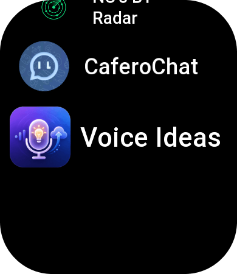
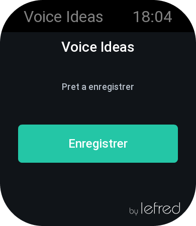
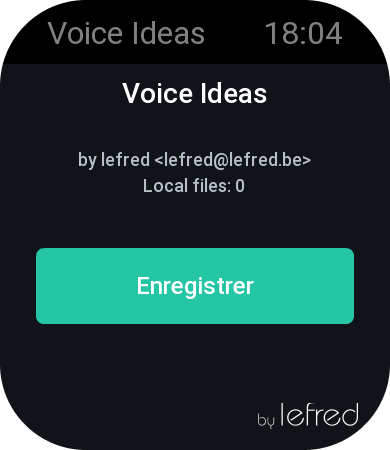
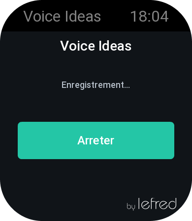
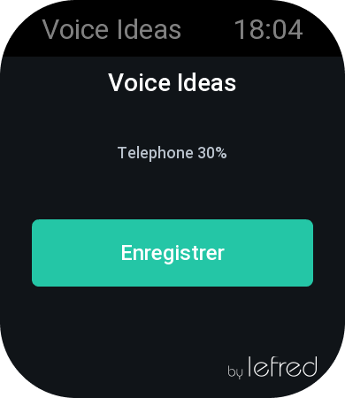
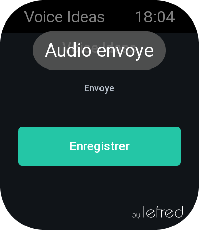

# Voice Ideas for Amazfit Bip 6

Mini-application Zepp OS 5 / API_LEVEL 4.2 qui enregistre une idee vocale sur la montre, sauvegarde le fichier localement, puis demande au Side Service telephone de l'envoyer a un serveur par HTTP POST.

## Structure typique Zepp OS

Un projet Zepp OS Mini Program contient generalement :

- `app.json` : manifeste de l'application, API cible, pages, Side Service, permissions.
- `page/` : code execute sur la montre. La cible Bip 6 detectee par le CLI local est `pamir`, ecran `390x450`, API max `4.2`.
- `data-widget/` : widget raccourci affiche dans les tuiles/widgets et ouvre la page principale.
- `app-side/` : Side Service execute cote telephone via l'application Zepp.
- `setting/` : ecran de reglages affiche cote telephone dans l'application Zepp.
- `shared/` ou petits adaptateurs : code de messagerie ou contrats communs.
- `package.json` : scripts locaux autour du CLI Zepp `zeus`.

Ce squelette suit cette structure. Les appels reseau sont uniquement dans `app-side/`, car la montre ne doit pas etre supposee capable d'appeler Internet directement.

## Commandes Linux

Installer le CLI Zepp OS :

```bash
npm install -g @zeppos/zeus-cli
```

Installer les dependances locales du projet :

```bash
npm install
```

Verifier que le CLI est disponible :

```bash
zeus --version
```

Construire le projet :

```bash
npm run build
```

Lancer le mode developpement :

```bash
npm run dev
```

Generer un apercu/QR de test si votre version du CLI le supporte :

```bash
npm run preview
```

## Configuration serveur

Editez `app-side/config.js` :

```js
export const SERVER_UPLOAD_URL = 'https://votre-serveur.example/api/voice-ideas'
```

Ces valeurs peuvent aussi etre modifiees depuis l'application Zepp sur le telephone, dans les reglages de l'application `Voice Ideas` :

- `Server upload URL`
- `Debug URL`
- `Recipient email`

Le Side Service utilise les reglages telephone s'ils existent, sinon les valeurs par defaut de `app-side/config.js`.
`Recipient email` est envoye au serveur avec chaque enregistrement sous le champ `recipientEmail`, ce qui permet au meme endpoint serveur de servir plusieurs montres.

Le serveur doit accepter un `multipart/form-data` avec :

- `audio` : fichier audio OPUS.
- `createdAt` : timestamp de creation.
- `recipientEmail` : adresse email destinataire optionnelle.

En mode JSON/base64, le serveur recoit aussi `recipientEmail` avec `audioBase64`.

Un exemple Express defensif est fourni dans `server-example/`. Il renvoie `400 MISSING_AUDIO` au lieu de planter en `500` si aucun fichier n'arrive.

### Transcription et email cote serveur

Le serveur d'exemple peut maintenant traiter automatiquement chaque idee recue :

1. sauvegarde du fichier Zepp brut ;
2. conversion du flux Zepp Opus en vrai fichier `.ogg` ;
3. conversion du `.ogg` en WAV 16 kHz mono avec `ffmpeg` ;
4. transcription locale avec `whisper.cpp` ;
5. sauvegarde d'un `.txt` ;
6. envoi de la transcription par email avec le `.ogg` en piece jointe.

Installer les dependances du serveur :

```bash
cd server-example
npm install
```

Installer `ffmpeg` et `whisper.cpp` :

```bash
sudo dnf install -y ffmpeg
```

Install whisper.cpp et le modele GGML small ou medium (environ 1.5 Go) :

Aller sur https://github.com/ggml-org/whisper.cpp/releases/tag/v1.9.1 et télécharger le binaire `whisper-cli` pour Linux.

Il faut aussi telecharger un modele GGML, par exemple `ggml-small.bin` ou `ggml-medium.bin`. Le script `download-ggml-model.sh` fourni dans le projet peut le faire automatiquement.

```bash
sudo bash ./models/download-ggml-model.sh small
```

Variables d'environnement minimales :

```bash
export FFMPEG_BIN="ffmpeg"
export WHISPER_CPP_BIN="/opt/whisper.cpp/build/bin/whisper-cli"
export WHISPER_CPP_MODEL="/opt/whisper.cpp/models/ggml-small.bin"
export WHISPER_CPP_LANGUAGE="fr"
export WHISPER_CPP_TIMEOUT_MS="120000"
export VOICE_IDEAS_KEEP_FILES="false"

export SMTP_HOST="smtp.example.com"
export SMTP_PORT="587"
export SMTP_SECURE="false"
export SMTP_USER="user@example.com"
export SMTP_PASS="mot-de-passe"
export SMTP_FROM="Voice Ideas <user@example.com>"
export MAIL_TO="vous@example.com"

export VOICE_IDEAS_UPLOAD_DIR="/var/vhosts/nodejs/voice-ideas-server/sounds"
```

Lancer le serveur :

```bash
npm start
```

Le serveur repond vite a la montre avec `processing: true`, puis fait conversion, transcription et email en arriere-plan. Les erreurs de transcription ou SMTP apparaissent dans les logs du serveur sans bloquer la montre.
Apres un envoi email reussi, le serveur supprime le fichier brut `.opus`, le `.ogg`, le `.wav` intermediaire et le `.txt`. Pour les conserver pendant un debug, utilisez `VOICE_IDEAS_KEEP_FILES=true`.

Pour tester manuellement la transcription locale :

```bash
ffmpeg -y -i sounds/2026-07-03_22-19-51-idea.ogg -ar 16000 -ac 1 -c:a pcm_s16le /tmp/idea.wav
/opt/whisper.cpp/build/bin/whisper-cli -m /opt/whisper.cpp/models/ggml-small.bin -f /tmp/idea.wav -l fr -otxt -of /tmp/idea
cat /tmp/idea.txt
```

## Points API a verifier dans votre SDK

Les noms exacts suivants dependent de la version du SDK Zepp OS Mini Program installee :

- `@zos/media` : ce squelette utilise l'API officielle `create(id.RECORDER)`, `setFormat(codec.OPUS, { target_file })`, `start()` et `stop()`.
- Liaison Side Service : ce projet utilise `MessageBuilder` et un envoi JSON/base64 par morceaux depuis la montre, car `TransferFile` ne declenchait pas fiablement `onReceivedFile` sur la Bip 6 testee.
- Envoi HTTP : le Side Service telephone reconstruit l'audio et poste un JSON contenant `audioBase64` vers le serveur.
- Widget : `data-widget/voice-ideas/index.js` sert uniquement de raccourci vers `page/index`, via `@zos/router`. Il ne demarre pas le micro directement.

L'alternative officielle la plus proche, si un nom diverge, reste :

- Enregistrement audio : module officiel `@zos/media`.
- Envoi reseau : Side Service app-side + `fetch`/API HTTP app-side documentee par Zepp.
- Liaison montre/telephone : `BasePage#request`/`BaseSideService`, ou l'API officielle de service app-side documentee pour votre version du SDK.

## Validation locale effectuee

Validation faite avec :

```bash
zeus --version
```

Version observee :

```text
zeus: v1.9.1
zpm: v3.4.1
```

Build reussi :

```bash
npm run build
```

Le package genere se trouve dans `dist/`.

Note manifeste : le cache local du CLI connait la Bip 6 sous le nom interne `pamir`, ecran `390x450`, API max `4.2`. Le manifeste garde le format packager v3 accepte par `zeus` (`st: "s"`, `dw: 390`) ; l'ajout direct des `deviceSource` Bip 6 dans `platforms` casse le packaging d'icone avec `zeus v1.9.1`.

## Test sur montre avec Zepp Developer Mode

1. Ouvrir l'application Zepp sur le telephone associe a l'Amazfit Bip 6.
2. Activer le Developer Mode dans les options developpeur Zepp.
3. Garder la montre connectee au telephone en Bluetooth.
4. Depuis ce dossier, lancer :

```bash
npm run build
zeus preview -s
```

5. Scanner le QR code ou choisir la montre cible selon l'interface affichee par `zeus`.
6. Ouvrir `Voice Ideas` sur la montre.
7. Appuyer sur `Enregistrer`.
8. Appuyer sur `Arreter`.
9. Verifier les logs `zeus` :
   - creation du fichier local ;
   - appel au Side Service ;
   - reponse HTTP du serveur.

## Flux implemente

1. `page/index.js` affiche le bouton et gere l'etat d'interface.
2. `page/recorder.js` demarre et arrete l'enregistrement via `@zos/media`.
3. `data-widget/voice-ideas/index.js` affiche un raccourci qui ouvre la page principale.
4. Le fichier est cree dans le sandbox local de la mini app.
5. `page/side-service.js` lit le fichier et l'envoie au Side Service telephone par morceaux.
6. `app-side/index.js` reconstruit l'audio et le poste vers `SERVER_UPLOAD_URL`.


## Screenshots







